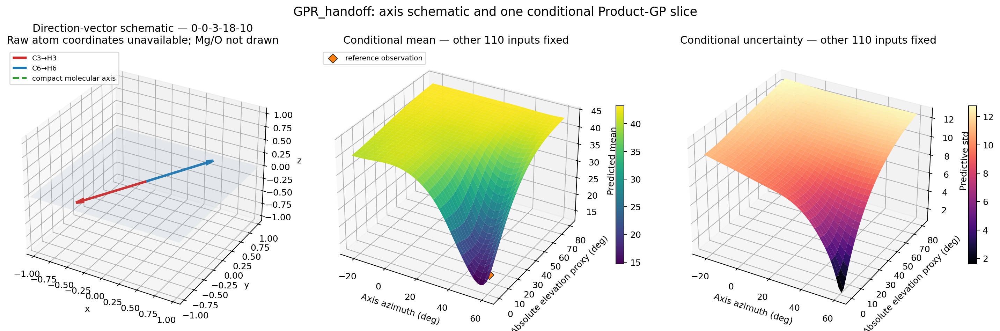

# GPR_handoff: RFとGaussian Processの比較

`GPR_handoff.zip` の170例を使い、受領Random Forest（RF）と複数のGaussian Process Regression（GPR）を同じHeld-out条件で比較します。

- [Google Colabで実行](https://colab.research.google.com/github/futoshi-futami/Chemistory/blob/main/notebooks/01_RF_and_GPR_handoff_Colab.ipynb)
- [カーネルの数式と解釈](docs/KERNELS_JA.md)
- [実験設定と詳細結果](docs/EXPERIMENTS_JA.md)

## 1. 何を予測するか

1行が1つの分子構造・実験条件に対応し、連続値 `y` を予測します。元PowerPointでは `y` はディラジカル性と説明されていますが、単位と量子化学的定義は同梱データにありません。

| 入力 | 内容 |
| --- | --- |
| base 111特徴 | H3/H6近傍のMg/O数、距離、非対称性、原子種、C3→H3・C6→H6方向 |
| `X_proc` 3,102特徴 | 物理的定義が未収録の高次元処理済み特徴 |
| 固定fold | 受領RFとの対応比較に使う10-fold番号 |

前処理はすべて訓練fold内でfitします。`X_proc` は標準化後にPCA8へ圧縮し、Held-out側をPCAやハイパーパラメータ推定に使いません。

## 2. なぜ4個の分子軸特徴を作ったか

C3→H3とC6→H6は全170例でほぼ反平行です。そのため、元の方向関連7列には同じ情報の重複があります。GPRに「分子軸」と「周囲の環境」の役割を分けて与えるため、次の4変数へ整理しました。

| 軸特徴 `a` | 意味 | 選んだ理由 |
| --- | --- | --- |
| `axis_azimuth_sin` | 分子軸のxy方位 `phi` のsin | −180°と+180°を連続に扱う |
| `axis_azimuth_cos` | 同じ方位のcos | sinと組にして方位を一意に表す |
| `axis_abs_elevation_rad_proxy` | 面外傾きの絶対値proxy | PowerPointで示唆された `z≈0` の違いを表す |
| `antiparallel_deviation_rad` | 2本のC–H方向の180°からのずれ | 完全な反平行からの歪みを残す |

元baseは111特徴です。方向7列を除いた104列から、各foldで定数となる2列を除いた102列を環境baseとします。

\[
a:4\text{次元},\qquad
e:102\text{（環境base）}+8\text{（PCA）}=110\text{次元}.
\]

したがってProduct GPの入力は合計114次元です。除外した列名は[カーネル文書](docs/KERNELS_JA.md#3-4個の軸特徴とproduct-kernel)に記載しています。

## 3. 比較したカーネル

標準化後の距離を (r)、White noiseを (k_W(x,x')=\sigma_n^2\mathbf 1[x=x']) と書きます。各定常GPRは「下表の信号カーネル＋White noise」です。

| 名前 | 信号カーネル | 関数のイメージ |
| --- | --- | --- |
| Matérn 1/2（Exponential） | (k_{M12}=\sigma_f^2e^{-r}) | 急な変化を許す |
| Matérn 3/2 | (k_{M32}=\sigma_f^2(1+\sqrt3r)e^{-\sqrt3r}) | 中程度に滑らか |
| Matérn 5/2 | (k_{M52}=\sigma_f^2(1+\sqrt5r+5r^2/3)e^{-\sqrt5r}) | Matérn 3/2より滑らか |
| RBF / Squared Exponential | (k_{RBF}=\sigma_f^2e^{-r^2/2}) | 非常に滑らか |
| Rational Quadratic | (k_{RQ}=\sigma_f^2(1+r^2/(2\alpha))^{-\alpha}) | 複数のRBF尺度の混合 |
| Linear / DotProduct | (k_{Lin}=\sigma_f^2(\sigma_0^2+x^\top x')) | 線形の対照 |

信号分散、長さ尺度、White noiseなどは、各訓練foldの対数周辺尤度を最大化する第二種最尤法で推定します。

現在の最良モデルは、軸 `a` と環境 `e` を分けたProduct GPです。

\[
\begin{aligned}
k_{Product}((a,e),(a',e'))
&=k_a(a,a')+k_e(e,e')\\
&\quad+k_{a\times e}((a,e),(a',e'))+k_W,\\
k_{a\times e}
&=\sigma_{ae}^2M_{3/2}(r_{a,ae})M_{3/2}(r_{e,ae}).
\end{aligned}
\]

`軸×環境` の積項は、軸も環境も似ている2例だけを強く似たものとして扱います。これは「分子軸の向きによってMg/O局所環境の効き方が変わる」という仮説を表します。

## 4. 評価結果

| Held-out設定 | Product GP R² / RMSE | 受領二段RF R² / RMSE |
| --- | ---: | ---: |
| 固定10-fold：既知trajectory内の補間 | **0.973807 / 1.638955** | 受領報告値 0.908223 / 3.067897 |
| trajectory group5：系列ごと未知 | **0.465545 / 7.403375** | 0.025996 / 9.994348 |
| trajectory group10：系列ごと未知 | **0.365228 / 8.068315** | −0.212622 / 11.151589 |

結果から言えることは次の3点です。

1. 固定10-foldでは、Product GPはRFと通常のMatérn 3/2 GPの両方を上回りました。
2. RBF、Matérn 3/2、Matérn 5/2、Rational Quadraticの通常GPRはほぼ同等でした。したがって改善の中心は「滑らかさの種類」より「軸×環境の相互作用」を入れたことです。
3. trajectoryを丸ごと未知にするとGPも大きく低下します。Product GPは同じ分割のRFより良好ですが、新しいtrajectoryへの外挿が解決したとは言えません。

受領RFの残差PLS5補正は固定10-foldでは有効でしたが、trajectory Held-outではbase RFより悪化しました。系列固有の残差パターンを学習した可能性があります。

## 5. 3D予測平均面と観測点がずれて見える理由



この3D面は高次元GPの**条件付き断面**です。表示している2変数だけを動かし、残り110入力は基準試料 `0-0-3-18-10` に固定しています。

従来図では、残り110入力が異なる全観測点を同じ2軸へ投影していたため、点が面上に乗らず、フィットがずれているように見えました。しかし、それらの点は同じ条件付き断面上のデータではありません。更新後の3D面には、残りの入力も一致する基準試料1点だけを重ねます。

なお、その基準点でも予測平均と観測値は完全一致するとは限りません。White noiseと正則化を含むGPは、観測点を必ず通る補間曲線ではないためです。

モデルのフィット具合は3D面ではなく、[OOF予測対実測・予測区間図](figures/gpr_handoff_oof_uncertainty.html)で確認します。3D面は「他の条件を固定したとき、モデル平均と分散がどう変わるか」を理解する図です。

## 6. Colabでの実行

Colabを開いて「ランタイム → すべてのセルを実行」を選びます。最初のセルがGitHub clone、データ準備、editable installを行うため、`chemistory_gpr` を手動でインストールする必要はありません。

ローカルでは次を実行します。

```bash
python -m pip install -e .
python scripts/prepare_data.py
pytest -q
```

主な再計算コマンドと成果物一覧は[実験詳細](docs/EXPERIMENTS_JA.md)にまとめています。

## 7. 解釈上の注意

- 固定10-foldの `R²=0.974` は主に既知trajectory内の補間性能です。
- Product kernelの優位性は相互作用仮説を支持しますが、Mg/O配置の因果効果を証明するものではありません。
- 左の分子図はsummaryから復元したC3→H3・C6→H6方向の模式図です。元原子座標とMg/O位置は同梱されていません。
- 次は `file_key` tokenの正式な物理定義を確認し、raw 3D特徴と独立trajectoryで検証する必要があります。
